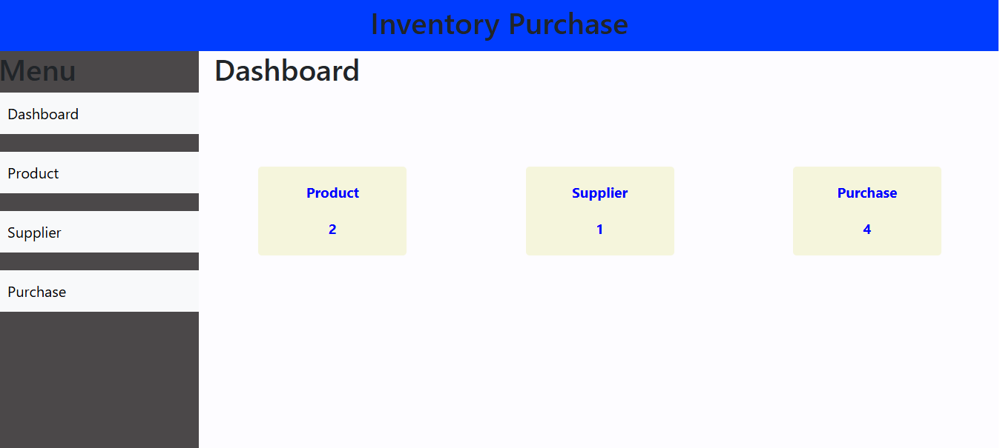
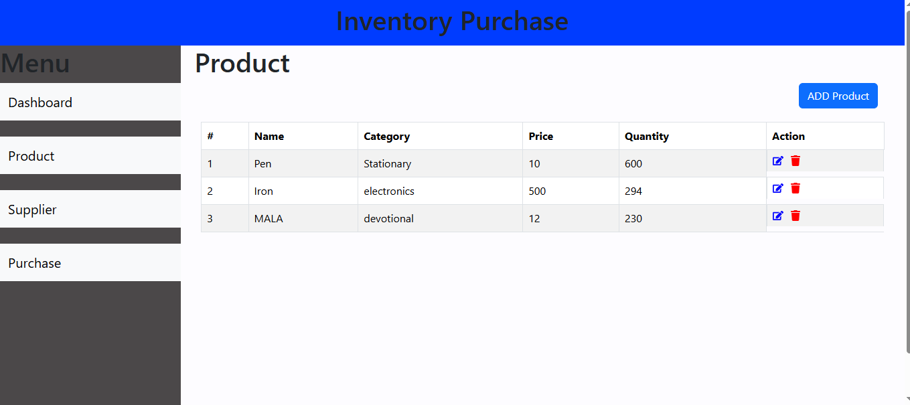
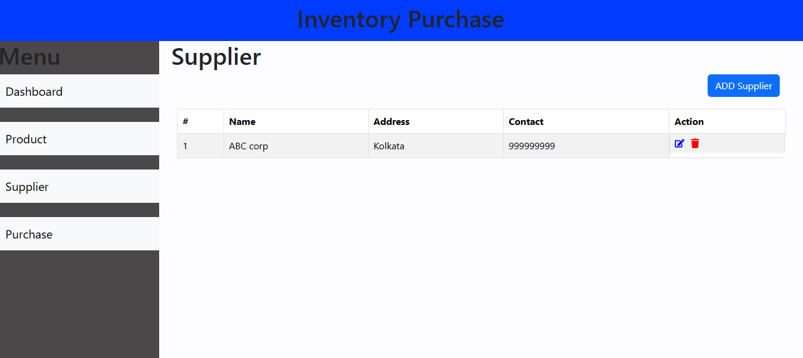

# Inventory & Purchase Management System

A full-stack web application for managing inventory and purchase-related workflows.

## 📌 Overview

Inventory & Purchase Management System is a web application built with a **React.js frontend** and **Java/Spring Boot backend**, with **MySQL** used for data persistence.

The application demonstrates frontend-backend integration through REST APIs and provides a structured workflow for managing inventory and purchase information.

## ✨ Key Features

* Product management
* Supplier management
* Purchase management
* Inventory and stock updates
* Responsive user interface
* Reusable React components
* REST API integration
* Spring Boot backend services
* MySQL database integration
* Frontend and backend communication

## 🛠️ Tech Stack

### Frontend

* React.js
* JavaScript
* React Bootstrap
* HTML5
* CSS3

### Backend

* Java
* Spring Boot
* Spring MVC
* REST APIs
* Maven

### Database

* MySQL

## 🏗️ Project Architecture

```text
React.js Frontend
       │
       │ REST APIs
       ▼
Spring Boot Backend
       │
       │ Database Operations
       ▼
     MySQL
```
## 📸 Application Screenshots

### Dashboard

The dashboard provides an overview of products, suppliers and purchase records.



### Product Management

Manage product information including product name, category, price and available quantity.



### Purchase Management

Record purchase transactions including supplier, product, purchase price, quantity and purchase date.


### Supplier Management

Manage supplier information including name, address and contact details.




## 📂 Project Structure

```text
InventoryPurchase/
│
├── frontend/
│   └── React.js application
│
├── backend/
│   └── Spring Boot application
│
├── screenshots/
│   ├── dashboard.png
│   ├── product-management.png
│   ├── purchase-management.png
│   └── supplier-management.png
│
└── README.md
```

## 🚀 Getting Started

### Prerequisites

Make sure you have installed:

* Node.js
* npm
* Java
* Maven
* MySQL
* Git

### Clone the repository

```bash
git clone https://github.com/amit2485/InventoryPurchase.git
cd InventoryPurchase
```

### Run the Frontend

```bash
cd frontend
npm install
npm start
```

The React application will run on:

```text
http://localhost:3000
```

### Run the Backend

Open another terminal and navigate to:

```bash
cd backend
```

Run the Spring Boot application from your IDE or using Maven.

Make sure your MySQL database configuration is correctly configured before starting the backend.

## 💡 What This Project Demonstrates

* Building a React.js frontend
* Creating reusable UI components
* Integrating React with REST APIs
* Developing backend services using Spring Boot
* Connecting applications with MySQL
* Working with frontend and backend application layers
* Understanding full-stack application flow

## 🔮 Future Improvements

* Authentication and authorization
* Advanced search and filtering
* Pagination
* Inventory reports
* Dashboard and analytics
* Automated testing
* Production deployment

## 👨‍💻 Author

**Amit Kumar Das**

React Developer | Frontend Developer

GitHub: [amit2485](https://github.com/amit2485)
